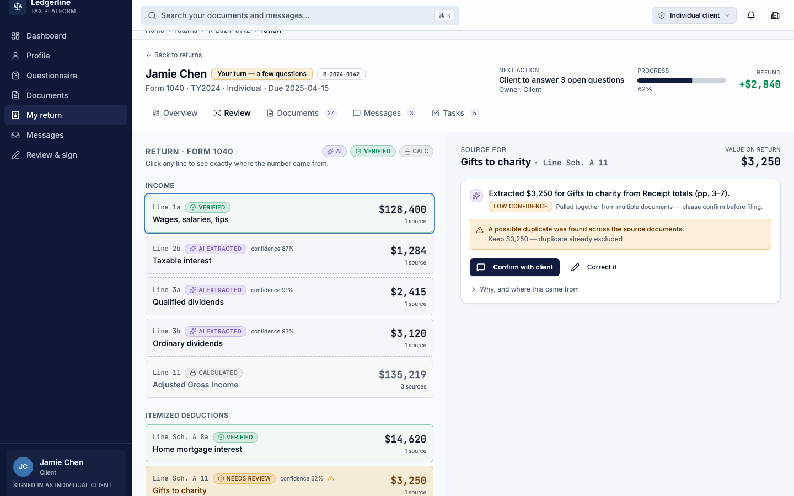
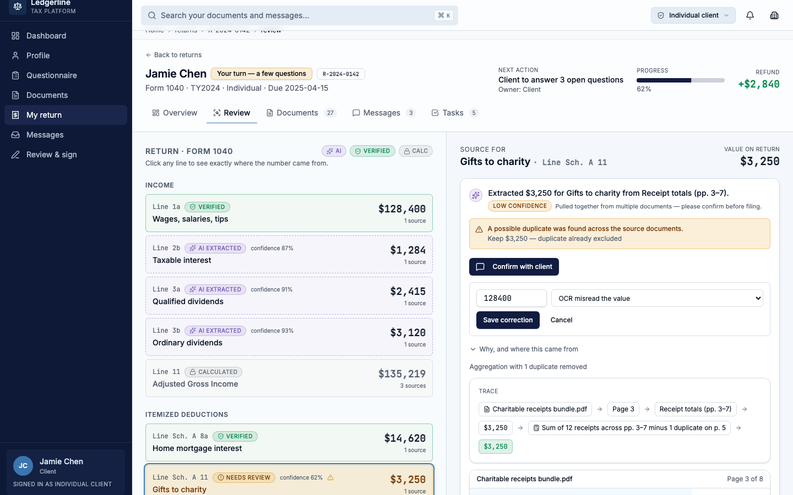

# AI Panel — Short Note

## What I built

- A panel that shows AI information next to each field on a tax return.
- It shows: what the AI did, how sure it is, any warning, and what to do next.
- You can open more details if you want, or fix the value yourself.

Location: `/returns/R-2024-0142/review` → click any field on the left.

## Screenshot

The AI found a possible duplicate. It shows low confidence and asks the user to confirm with the client.

The user can fix the value right here, with a short reason. No new page.

## What is real vs. what is fake

**Real (actually works in the app):**
- Clicking Approve, Correct it, or Undo changes the real state on screen.
- The value on the return updates right away after a correction.
- Every action is reversible (you can Undo).

**Fake (simulated for the demo):**
- There is no real AI model. A function called `getAIInsight` makes up the AI answer, using data already in the mock file.
- "Confirm with client" does not send a real message. It only changes the button on screen.
- The "duplicate" warning is found by a simple keyword check, not real document comparison.
- Only one return has full sample data (`R-2024-0142`). Other returns will look empty.

## Decisions I want to explain

- **Simple first, details later.** The panel shows one short sentence first. All the technical details (page number, exact box, calculation) are hidden behind a "Why, and where this came from" link. This keeps the panel simple, but nothing is hidden forever.
- **Only one action button.** Instead of many buttons, each field shows only one clear next step: Approve, Confirm with client, or nothing (if it's already done). This makes it easy to know what to do.
- **Confidence in plain words.** The panel says "High confidence" or "Low confidence" with a short reason, not just a number like "87%". Numbers are still shown in the smaller list on the left, for expert users.
- **Correcting is safe.** Fixing a value never leaves the page and can always be undone. This makes users feel safe to try it.
